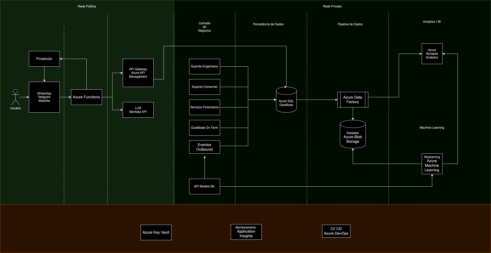

# Solubio - Arquitetura do Chatbot

Esta arquitetura descreve um chatbot inteligente implantado no Azure, integrando o Azure Synapse Analytics para análises de negócios e relatórios de BI. A solução, desenvolvida para a Solubio, visa revolucionar a interação com os produtores rurais que utilizam a tecnologia Onfarm, oferecendo suporte completo, automação de tarefas e insights preditivos para otimizar a produção agrícola. A arquitetura é projetada para ser escalável, segura, eficiente em termos de custos e focada na experiência do usuário.

### Visão Geral

O chatbot atua como um ponto central de contato para os produtores, oferecendo acesso a serviços financeiros, suporte agronômico, engenharia, comercial e de qualidade. A integração com a aplicação Machine Learning permite análises preditivas para auxiliar na alocação de recursos, previsão de colheitas e otimização do plantio. A plataforma Azure garante a segurança, escalabilidade e confiabilidade da solução. Em termos de Bussines Inteligence, a integração com o Azure Synapse Analytics permite a coleta e análise de dados das interações dos clientes, fornecendo insights valiosos sobre suas necessidades e preferências.

## Componentes da Arquitetura

### Camada de Interação com o Usuário

- **Canais de Mensagem:** WhatsApp e outros.
- **Azure Logic Apps/Azure Functions:**  Orquestra o fluxo de mensagens entre os canais e a Maritaca IA, formatando as mensagens e gerenciando a comunicação.
- **Application Insights:** Monitora o desempenho e a disponibilidade das interações.

### Camada de Inteligência Artificial

- **Maritaca IA:**  Processa as mensagens dos usuários e gera respostas inteligentes.
- **API Maritaca IA:** Interface para interação com a Maritaca IA.
- **Azure Key Vault:** Armazena as chaves de API e segredos de forma segura.
- **Application Insights:** Monitora o desempenho e a disponibilidade da API.

### Camada de Negócios

- **Azure Functions/Azure App Service:** Implementa a lógica de negócios para os diferentes serviços oferecidos pela Solubio:
Serviços Financeiros: Consulta e geração de boletos, consulta de faturamento, solicitação de NF-e, renegociação.
Suporte Agronômico: Procedimentos de acordo com as fases da cultura, feedback sobre tratamentos, recomendações personalizadas.
Suporte de Engenharia: Consulta de novos projetos, suporte e manutenção de equipamentos.
Suporte Comercial: Pedido de material de apoio, portfólio de produtos, novas negociações.
Suporte de Qualidade Onfarm: Processos de multiplicação, consultas de análises e laudos.

- **API de Integração com Banco de Dados:**  Fornece acesso ao Azure SQL Database para operações transacionais.  Este componente pode ser revisado dependendo da sua estratégia de dados com o Data Lake e Serverless SQL Pool.
- **Eventos Outbound (Azure Notification Hubs):** Envio de notificações proativas para os produtores, como lembretes de entrega, agendamento de visitas e informações sobre cobranças.
- **Azure Key Vault:** Armazena credenciais de acesso ao banco de dados.
- **Application Insights:**-  Monitora o desempenho e a disponibilidade dos serviços.

### Camada de Dados

- **Azure Data Factory:** Orquestra a extração, transformação e carregamento (ETL) de dados para o Data Lake e o Azure Synapse Analytics.
- **Azure Blob Storage (Data Lake):** Armazena dados brutos e processados.
- **Azure Synapse Analytics (Serverless SQL Pool):**  Permite consultas e análises diretamente no Data Lake, sem a necessidade de um data warehouse dedicado. Utilizado para exploração de dados e cenários com baixo/médio volume de dados.
- **Azure Synapse Analytics (Dedicated SQL Pool - BI):** Data warehouse dedicado para análises de negócios e relatórios de BI. Armazena dados otimizados para consultas analíticas e dashboards.
- **Azure Machine Learning:**  Plataforma para treinamento e implantação de modelos de machine learning.  Utiliza dados do Data Lake para treinamento.
- **API de Integração com Modelo de ML:**  Interface para acesso às predições do modelo de machine learning, integrando-o com o chatbot e outros serviços.
- **Azure Key Vault:** Armazena segredos relacionados ao modelo de ML.
- **Application Insights:** Monitora o desempenho, a disponibilidade e a acurácia do modelo de machine learning.
  

### Camada de Visualização

- **Power BI (ou outra ferramenta de BI):**  Conecta-se ao Azure Synapse Analytics (Dedicated SQL Pool) para criar e visualizar relatórios e dashboards interativos.

### Fluxo de Dados

Os dados fluem das aplicações de negócio para o Data Lake através do Azure Data Factory.  O Azure Data Factory também alimenta o Azure Synapse Analytics (Dedicated SQL Pool) com dados otimizados para BI.  O Azure Synapse Analytics (Serverless SQL Pool) permite consultas diretamente no Data Lake.  As ferramentas de BI, como o Power BI, conectam-se ao Dedicated SQL Pool para criar relatórios e dashboards.

### CI/CD (Azure DevOps)

- **Automação de Build e Deploy:** Automatiza o processo de build e deploy de todos os componentes.
- **Testes Automatizados:** Integra testes automatizados no pipeline de CI/CD.
- **Gerenciamento de Versões:** Controla as diferentes versões da aplicação.

### Benefícios

- **Experiência do Produtor Aprimorada:** Acesso fácil e rápido a informações e serviços, suporte personalizado e proativo, com foco na otimização da produção.
- **Eficiência Operacional para a Solubio:** Automação de tarefas, redução de custos operacionais, aumento da produtividade da equipe, insights de negócios para tomada de decisões estratégicas.
- **Escalabilidade e Flexibilidade:** A arquitetura permite escalar os recursos conforme a demanda, adaptando-se ao crescimento da Solubio e às necessidades dos produtores.
- **Previsões e Insights com Machine Learning:** Auxilia os produtores na tomada de decisões estratégicas, otimizando o plantio, prevendo colheitas e alocando recursos de forma eficiente.
- **Segurança e Confiabilidade:** A plataforma Azure garante a segurança dos dados e a alta disponibilidade da solução.

 
# Arquitetura Solubio - Estimativa de Custos

Calculamos esta estimativa proporcional a 1000 acessos por dia, com volume de dados de 1GB. Consideramos também a cotação do dólar a R$5,73 respectivos a data do cálculo.

| Serviço | Detalhes | Estimativa Mensal (BRL) |
| ------- | -------- | ----------------------- |
| Maritaca IA | R$ 0,0015 por acesso. 30.000 acessos/mês * R$ 0,0015/acesso = R$ 45,00 | R$ 45,00 |
| Azure SQL Database | 10 GB, assumindo um plano de serviço básico. Este item pode ser revisado dependendo da sua estratégia de armazenamento de dados com o Data Lake e o Serverless SQL Pool. | R$ 573,00 (aprox.) |
| Azure Blob Storage (Data Lake) | 1 GB.  Este custo pode variar dependendo do tipo de armazenamento e acesso aos dados. | R$ 11,46 (aprox.) |
| Azure Machine Learning | Treinamento 1x por mês, assumindo um plano básico de treinamento. Este custo pode variar dependendo do tamanho e complexidade do treinamento. | R$ 57,30 (aprox.) |
| Azure Functions/Logic Apps | Considerando um consumo moderado para 30.000 acessos, assumindo um custo médio de R$0,0001 por acesso. Este custo pode variar dependendo da execução das funções e integrações. | R$ 3,00 |
| Azure Key Vault | Plano básico | R$ 28,65 (aprox.) |
| Application Insights | 1 GB de dados. Este custo pode variar dependendo do volume de dados ingeridos. | R$ 114,60 (aprox.) |
| Azure DevOps | Plano básico (gratuito para até 5 usuários) | R$ 0,00 |
| Azure Notification Hubs | Assumindo um volume baixo de notificações, aproximadamente o mesmo número de acessos. Este custo pode variar dependendo do volume de notificações. | R$ 3,00 (aprox.) |
| Azure Synapse Analytics (Serverless SQL Pool) | Processamento de 1 GB de dados por mês. Este custo é baseado no volume de dados processados e pode variar. | R$ 0,03 (aprox.) |
| Total Estimado | | R$ 836,04 (aprox.) |

### Observações importantes

- **Valores aproximados:**  Os valores são estimativas e podem variar dependendo do consumo real dos recursos, da configuração dos serviços e da flutuação do câmbio.
- **Otimização:** É possível otimizar os custos ajustando os planos de serviço, implementando mecanismos de cache, monitorando o consumo de recursos e utilizando as melhores práticas para cada serviço.

## Resultados Esperados da Solução de Chatbot e Machine Learning para a Solubio

Nossa solução integrada de chatbot e machine learning visa revolucionar a experiência do produtor rural com a tecnologia Onfarm da Solubio, agregando valor em diversas áreas e impulsionando a eficiência e a produtividade.  Esperamos alcançar os seguintes resultados:

### Melhorias para a Solubio

- **Experiência do Cliente Aprimorada:** O chatbot oferece um canal de comunicação instantâneo e personalizado, disponível 24/7, para atender às demandas dos produtores de forma ágil e eficiente.  A centralização das informações e serviços em um único ponto de contato simplifica a interação e aumenta a satisfação do cliente.
- **Eficiência Operacional:** A automação de tarefas repetitivas, como consultas financeiras, suporte técnico e solicitações de documentos, libera a equipe da Solubio para focar em atividades estratégicas e de maior valor agregado.  Isso reduz custos operacionais e aumenta a produtividade da equipe.
- **Escalabilidade:** A solução é projetada para escalar conforme o crescimento da Solubio, atendendo a um número crescente de clientes sem comprometer a qualidade do atendimento.
- **Insights de Negócios:** A integração com o Azure Synapse Analytics permite a coleta e análise de dados das interações dos clientes, fornecendo insights valiosos sobre suas necessidades e preferências.  Esses dados podem ser utilizados para aprimorar os produtos e serviços da Solubio, personalizando a oferta e antecipando as demandas do mercado.
- **Fidelização de Clientes:**  A experiência aprimorada e o suporte personalizado contribuem para a fidelização dos clientes, fortalecendo o relacionamento entre a Solubio e os produtores rurais.
- **Vantagem Competitiva:** A solução inovadora de chatbot e machine learning diferencia a Solubio da concorrência, posicionando-a como líder em tecnologia e inovação no setor.

### Valores Agregados ao Modelo de Negócio

- **Proatividade:** O chatbot não apenas responde às solicitações dos clientes, mas também pode ser proativo, oferecendo informações relevantes, dicas e sugestões personalizadas com base no histórico do produtor.
- **Personalização:** A solução permite personalizar a comunicação e os serviços oferecidos, adaptando-se às necessidades específicas de cada produtor.
- **Integração:** A integração com os sistemas da Solubio garante a consistência das informações e a eficiência dos processos.
- **Inovação:** A utilização de tecnologias de ponta, como machine learning e processamento de linguagem natural, demonstra o compromisso da Solubio com a inovação e a busca por soluções de alto valor agregado.

### Ganhos Mensuráveis

- **Redução no tempo de atendimento ao cliente:**  Mensurável pelo tempo médio de resposta do chatbot e pela redução no volume de chamadas e e-mails para o suporte.
- **Aumento na satisfação do cliente:**  Mensurável por pesquisas de satisfação e feedback dos usuários.
- **Redução nos custos operacionais:**  Mensurável pela redução de custos com pessoal e processos manuais.
- **Aumento na produtividade da equipe:**  Mensurável pelo aumento no número de atendimentos e tarefas concluídas.
- **Aumento nas vendas:**  Potencialmente mensurável pelo aumento na conversão de leads e no volume de negócios gerados pelos clientes que utilizam o chatbot.
- **Melhora na eficiência do plantio:** Mensurável pelo aumento da produtividade das colheitas e redução de perdas.

### Possíveis Perdas (e Mitigação)

- **Resistência à adoção da tecnologia:** Alguns produtores podem resistir à utilização do chatbot.  Para mitigar esse risco, é fundamental investir em treinamento e comunicação, demonstrando os benefícios da solução e oferecendo suporte durante a transição.
- **Custos iniciais de implementação:**  A implementação da solução requer um investimento inicial.  No entanto, os ganhos de eficiência e produtividade a longo prazo compensam esse investimento.
- **Dependência da tecnologia:**  É importante garantir a redundância e a disponibilidade da solução para evitar interrupções no serviço.  A arquitetura proposta no Azure oferece alta disponibilidade e resiliência.

## Conclusão

Em resumo, nossa solução de chatbot e machine learning para a Solubio oferece um conjunto de benefícios que contribuem para a melhoria da experiência do cliente, aumento da eficiência operacional e geração de valor para o negócio.  Acreditamos que esta solução representa um passo importante para a transformação digital do agronegócio, empoderando os produtores rurais com tecnologia e informação para alcançar juntos melhores resultados.